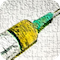

<h1 id="top">Medtouch Applications</h2>

iOS Applications           |  Android Applications
:-------------------------:|:-------------------------:
 | 

##### These are the applications built and deployed during my work at [Medtouch](https://www.medtouch.com.br)

### iOS Applications:

These applications were built using Objective-C and some were rebuilt with Swift. I'll try to show the main features of each one and what can be done to improve them.

                  

<h2 id="codeblue">Code Blue</h2>
<b>Code Blue</b> is an application blablabla blablablablablabla blablablablablabla blablabla blablabla.
 
 

### Features: 
1. Created a database in Firebase and connected to the app, with the names and images to be shown on the cards;

2. A ***Header/NavBar*** with three icons;

3. A body with a stack of cards, with the functionality of swipe right or left;

### Improvements:

1. Create the other functionalities/screens of the app;

2. Put each and every one button to work properly;

2. Authentication for the users in Firebase;

[Back to Top](#top)

<h2 id="condutas">Condutas em Emergência(Emergency Conducts)</h2>
<b>Condutas em Emergência</b> is an application blablabla blablablablablabla blablablablablabla blablabla blablabla. 
 
 

### Features: 
1. Created a database in Firebase and connected to the app, with the names and images to be shown on the cards;

2. A ***Header/NavBar*** with three icons;

3. A body with a stack of cards, with the functionality of swipe right or left;

### Improvements:

1. Create the other functionalities/screens of the app;

[Back to Top](#top)

<h2 id="dengue">Dengue</h2>
<b>Dengue</b> is an application blablabla blablablablablabla blablablablablabla blablabla blablabla.
 
 

### Features: 
1. Created a database in Firebase and connected to the app, with the names and images to be shown on the cards;

2. A ***Header/NavBar*** with three icons;

3. A body with a stack of cards, with the functionality of swipe right or left;

### Improvements:

1. Create the other functionalities/screens of the app;

[Back to Top](#top)

<h2 id="doccalc">DocCalc</h2>
<b>DocCalc</b> is an application blablabla blablablablablabla blablablablablabla blablabla blablabla.
 
 

### Features: 
1. Created a database in Firebase and connected to the app, with the names and images to be shown on the cards;

2. A ***Header/NavBar*** with three icons;

3. A body with a stack of cards, with the functionality of swipe right or left;

### Improvements:

1. Create the other functionalities/screens of the app;

[Back to Top](#top)

<h2 id="drogas">Drogas em Emergência & CTI(4 Idioms: PT, EN, ES, CH)</h2>
<b>Drogas em Emergência</b> is an application blablabla blablablablablabla blablablablablabla blablabla blablabla.
 
 

### Features: 
1. Created a database in Firebase and connected to the app, with the names and images to be shown on the cards;

2. A ***Header/NavBar*** with three icons;

3. A body with a stack of cards, with the functionality of swipe right or left;

### Improvements:

1. Create the other functionalities/screens of the app;

[Back to Top](#top)

<h2 id="drugs">Drugs in Emergency</h2>
<b>Drugs in Emergency</b> is an application blablabla blablablablablabla blablablablablabla blablabla blablabla.
 
 

### Features: 
1. Created a database in Firebase and connected to the app, with the names and images to be shown on the cards;

2. A ***Header/NavBar*** with three icons;

3. A body with a stack of cards, with the functionality of swipe right or left;

### Improvements:

1. Create the other functionalities/screens of the app;

[Back to Top](#top)

<h2 id="epons">Epônimos</h2>
<b>Epônimos</b> is an application blablabla blablablablablabla blablablablablabla blablabla blablabla.
 
 

### Features: 
1. Created a database in Firebase and connected to the app, with the names and images to be shown on the cards;

2. A ***Header/NavBar*** with three icons;

3. A body with a stack of cards, with the functionality of swipe right or left;

### Improvements:

1. Create the other functionalities/screens of the app;

[Back to Top](#top)

<h2 id="gravlact">Gravidez e Lactação</h2>
<b>Gravidez e Lactação</b> is an application blablabla blablablablablabla blablablablablabla blablabla blablabla.
 
 

### Features: 
1. Created a database in Firebase and connected to the app, with the names and images to be shown on the cards;

2. A ***Header/NavBar*** with three icons;

3. A body with a stack of cards, with the functionality of swipe right or left;

### Improvements:

1. Create the other functionalities/screens of the app;

[Back to Top](#top)

<h2 id="guiaatms">Guia de Antimicrobianos</h2>
<b>Guia de Antimicrobianos</b> is an application blablabla blablablablablabla blablablablablabla blablabla blablabla.
 
 

### Features: 
1. Created a database in Firebase and connected to the app, with the names and images to be shown on the cards;

2. A ***Header/NavBar*** with three icons;

3. A body with a stack of cards, with the functionality of swipe right or left;

### Improvements:

1. Create the other functionalities/screens of the app;

[Back to Top](#top)

<h2 id="prescs">Prescrições Médicas</h2>
<b>Prescrições Médicas</b> is an application blablabla blablablablablabla blablablablablabla blablabla blablabla.
 
 

### Features: 
1. Created a database in Firebase and connected to the app, with the names and images to be shown on the cards;

2. A ***Header/NavBar*** with three icons;

3. A body with a stack of cards, with the functionality of swipe right or left;

### Improvements:

1. Create the other functionalities/screens of the app;

[Back to Top](#top)

### Obs:
The app can be seen [here](https://tinder-clone-c1a91.web.app)

[Back to Top](#top)
