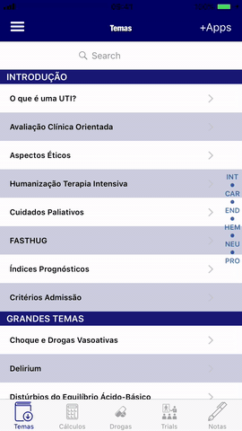
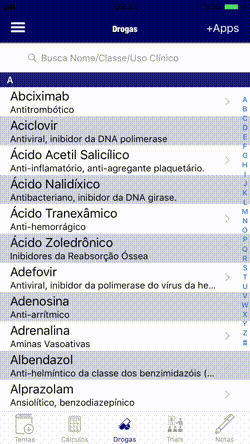
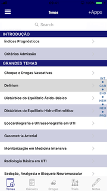
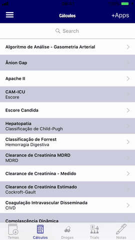
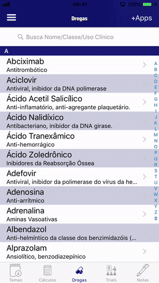
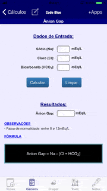
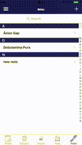
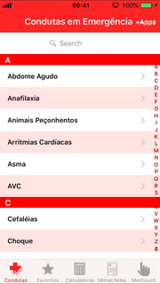
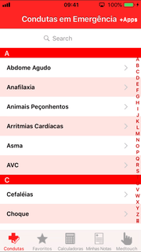
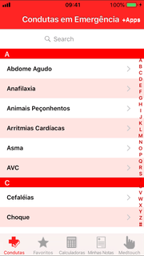

<h1 id="top">Medtouch Applications</h2>

##### These are the applications built and deployed during my work at [Medtouch](https://www.medtouch.com.br).  During these over 8 years, I've built over 10 apps for the [iOS Platform](#appios) and 5 for the [Android Platform](#appandroid) and the respective app updates for both platforms.

##### It is worth mentioning the "timing", i.e., some features that with the current tools and frameworks are trivial to do, was done/built "manually" and I'll present this as it was at that time (innovative, difficult to accomplish, etc).

### iOS: 

&nbsp;&nbsp;  

&nbsp;&nbsp;                   

### Android: 

 

&nbsp;&nbsp;         

<h2 id="appios">iOS Applications:</h3>
Most of the applications for the iOS platform were built in Objective-C, using all different types of tools and frameworks available at the time I'll try to show the main features of each one and what can be done to improve them.

[Back to Top](#top)
----

<b>Code Blue</b> The most complete application of Intensive Care Medicine in Brazil, developed by specialist doctors qualified by AMIB!
 

### Features: 
1. Built using Objective-C language;
2. Use of custom table view index, using the first three letters of the category and javascript commands inside the objective-C code (use of search bar to find and highlight keywords in the text); 

3. Use of the FPPopover and MFSideMenu libraries on the first tab, the first to create a Popover with the topics of text and the second to create a Side Menu ("drawer"); 
&nbsp;&nbsp;&nbsp;&nbsp;&nbsp;&nbsp; 
4. 88 Calculators, 201 Drugs and 119 Trials(Article summaries) built using HTML/CSS/Javascript and wrapped in a webview; 
&nbsp;&nbsp;&nbsp;&nbsp;&nbsp;&nbsp;
5. A Note Taking tab, where you can save your simple notes for future consultation; 
&nbsp;&nbsp;&nbsp;&nbsp;&nbsp;&nbsp;

### Improvements:
1. Most of the app's content is in html format, accessed through property lists with title and file name. A suggestion to improve the performance and security of the app is to put these files in a real database, with all its access control and security features and generate each html file at time of use;
2. In addition, greater attention should be paid to UI/UX;
3. Improvements on Autolayout implementations must be done;

[Back to Top](#top)
----

<b>Condutas em Emergências</b> Your emergency shifts will be calmer now. Fast and reliable information on more than 30 serious diseases!
 

### Features:
1. Built using Objective-C language;
2. For this application, all the content was already divided into hundreds of PDF files, so to increase productivity, it was decided to use these files wrapped in a WebView;
3. Traditional app, consisting of a TabViewController in which each tab is a TableView with its respective Detail View Controller; 

4. In the case of the Calculators Tab, a UISegmentedControl was used to switch the display of calculators between "All calculations" and "By Category". In this case, the customized index was chosen, with the initial letters of each category; 

5. A great feature implemented in the app, to serve a large number of users who have requested this is the possibility to take notes; 
&nbsp;&nbsp;&nbsp;&nbsp;&nbsp;&nbsp;
6. Another interesting feature of this app is the possibility to save conducts as favorites; 
&nbsp;&nbsp;&nbsp;&nbsp;&nbsp;&nbsp;

### Improvements:
1. As all the content was in pdfs, and used as so, a suggestion to improve the performance and security of the app is to put their content in a database, with all its access control and security features and generate each html file at time of use;
2. Think in transitioning the code to Swift;
3. Change the architecture MVC to MVVM and refactor the code to make it easy to build Tests;
4. Here, again, more attention should be paid to UI/UX;
5. Improvements on Autolayout implementations must be done;

[Back to Top](#top)
----

<b>Dengue</b> Diagnostic and therapeutic management guide for adults and children prepared by the Ministry of Health.
 
 
 
 
### Features:
1. Built using Objective-C language and updated to Swift;
2. The app consists of a TabViewController with 5 tabs, where the first four are webviews with the Html/CSS/Bootstrap/JS/jQuery app on it and the same feature of the app **Code Blue** (to create a list with the titles in the text, for quick access) was done, but in this case it was built with Html/CSS/Bootstrap/JS/jQuery resources; 

3. The fifth tab ("share") of the app consists in a TableView Object where each row provide a different link to the company on internet, like social networks (Twitter or Facebook), the Developer's website, to an online registration form or to send an email to the company and in the upper right there is a button that opens a View with the other apps of the developer; 

### Improvements:
1. Change the architecture MVC to MVVM and refactor the code to make it easy to build Tests;
2. Here, again, some stuff to do in UI/UX;
3. Improvements on Autolayout implementations must be done;
4. Change the architecture MVC to MVVM and refactor the code to make it easy to build Tests;
5. One radical change suggested by some executives of the developer is to switch to an cross-platform approach, using the same base of the Android App, that way the resources would be better used;

[Back to Top](#top)
----

<b>DocCalc</b> More than 300 medical calculations, with algorithms, scores, unit converters, classifications, formulas, diagnostic and prognostic criteria, to assist in your medical practice.
 
 
 
 
### Features: 
1. Built using Objective-C language;
2. Lorem ipsum dolor sit amet, consectetur adipisicing elit, sed do eiusmod tempor incididunt ut labore et dolore magna aliqua. Ut enim ad minim veniam, quis nostrud exercitation ullamco laboris nisi ut aliquip ex ea commodo consequat;
3. Lorem ipsum dolor sit amet, consectetur adipisicing elit, sed do eiusmod tempor incididunt ut labore et dolore magna aliqua. Ut enim ad minim veniam, quis nostrud exercitation ullamco laboris nisi ut aliquip ex ea commodo consequat;

### Improvements:
1. All the content is in html files, a suggestion to improve the performance and security of the app is to put their content in a database, with all its access control and security features and generate each html file at time of use;
2. Think in transitioning the code to Swift;
3. Here, again, more attention should be paid to UI/UX;
4. Improvements on Autolayout implementations must be done;
5. Change the architecture MVC to MVVM and refactor the code to make it easy to build Tests;
6. One radical change suggested by some executives of the developer is to switch to an cross-platform approach, using the same base of the Android App, that way the resources would be better used;

[Back to Top](#top)
----

<b>Dr Aureo</b> Application for Dr. Aureo's patients. Various information about your doctor. Tips on health and medical examinations, calculations (BMI, ideal weight, etc.) and recommendations from professionals in other specialties.
 
 
 
 
### Features: 
1. Built in Html/CSS/JS, using Apache Cordova to wrap in native code;
2. Lorem ipsum dolor sit amet, consectetur adipisicing elit, sed do eiusmod tempor incididunt ut labore et dolore magna aliqua. Ut enim ad minim veniam, quis nostrud exercitation ullamco laboris nisi ut aliquip ex ea commodo consequat;
3. Lorem ipsum dolor sit amet, consectetur adipisicing elit, sed do eiusmod tempor incididunt ut labore et dolore magna aliqua. Ut enim ad minim veniam, quis nostrud exercitation ullamco laboris nisi ut aliquip ex ea commodo consequat;

### Improvements:
1. Think in transitioning the code to Swift;
2. Here, again, more attention should be paid to UI/UX;
3. Improvements on Autolayout implementations must be done;
4. Change the architecture MVC to MVVM and refactor the code to make it easy to build Tests;
5. One radical change suggested by some executives of the developer is to switch to an cross-platform approach, using the same base of the Android App, that way the resources would be better used;

[Back to Top](#top)
----

<b>Drogas em Emergência & CTI</b> A quick reference guide with the main drugs used in emergency and intensive care, made by physicians who work "on the front line"!
 
 
 
 
### Features: 
1. Built using Objective-C language;
2. 4 Idioms: PT, EN, ES, CH;
3. Lorem ipsum dolor sit amet, consectetur adipisicing elit, sed do eiusmod tempor incididunt ut labore et dolore magna aliqua. Ut enim ad minim veniam, quis nostrud exercitation ullamco laboris nisi ut aliquip ex ea commodo consequat;
4. Lorem ipsum dolor sit amet, consectetur adipisicing elit, sed do eiusmod tempor incididunt ut labore et dolore magna aliqua. Ut enim ad minim veniam, quis nostrud exercitation ullamco laboris nisi ut aliquip ex ea commodo consequat;

### Improvements:
1. All the content is in .plist files, a suggestion to improve the performance and security of the app is to put their content in a database, with all its access control and security features;
2. Think in transitioning the code to Swift;
3. Here, again, more attention should be paid to UI/UX;
4. Improvements on Autolayout implementations must be done;
5. Change the architecture MVC to MVVM and refactor the code to make it easy to build Tests;

[Back to Top](#top)
----

<b>Epônimos</b> THE WORLD'S MOST COMPLETE APP IN THE GENDER! More than 4000 terms in Medicine, Dentistry, Nutrition, Physiotherapy and Nursing!
 
 
 
 
### Features: 
1. Built using Objective-C language;
2. Lorem ipsum dolor sit amet, consectetur adipisicing elit, sed do eiusmod tempor incididunt ut labore et dolore magna aliqua. Ut enim ad minim veniam, quis nostrud exercitation ullamco laboris nisi ut aliquip ex ea commodo consequat;
3. Lorem ipsum dolor sit amet, consectetur adipisicing elit, sed do eiusmod tempor incididunt ut labore et dolore magna aliqua. Ut enim ad minim veniam, quis nostrud exercitation ullamco laboris nisi ut aliquip ex ea commodo consequat;

### Improvements:
1. Think in transitioning the code to Swift;
2. Here, again, more attention should be paid to UI/UX;
3. Improvements on Autolayout implementations must be done;
4. Change the architecture MVC to MVVM and refactor the code to make it easy to build Tests;

[Back to Top](#top)
----

<b>Gravidez e Lactação</b> A reliable guide containing Conducts, Calculators and Drug Guide for the management of pregnant and lactating women, in a FRIENDLY INTERFACE!
 
 
 
 
### Features: 
1. Built using Objective-C language;
2. Lorem ipsum dolor sit amet, consectetur adipisicing elit, sed do eiusmod tempor incididunt ut labore et dolore magna aliqua. Ut enim ad minim veniam, quis nostrud exercitation ullamco laboris nisi ut aliquip ex ea commodo consequat;
3. Lorem ipsum dolor sit amet, consectetur adipisicing elit, sed do eiusmod tempor incididunt ut labore et dolore magna aliqua. Ut enim ad minim veniam, quis nostrud exercitation ullamco laboris nisi ut aliquip ex ea commodo consequat;

### Improvements:
1. Think in transitioning the code to Swift;
2. Here, again, more attention should be paid to UI/UX;
3. Improvements on Autolayout implementations must be done;
4. Change the architecture MVC to MVVM and refactor the code to make it easy to build Tests;

[Back to Top](#top)
----

<b>Guia de Antimicrobianos</b> Therapeutic indications for more than 500 infections, in adults and children; Surgical prophylaxis; Pharmacological Guide; 180 Most common bacteria, calculators, etc.
 
 
 
 
### Features: 
1. Built using Objective-C language;
2. Lorem ipsum dolor sit amet, consectetur adipisicing elit, sed do eiusmod tempor incididunt ut labore et dolore magna aliqua. Ut enim ad minim veniam, quis nostrud exercitation ullamco laboris nisi ut aliquip ex ea commodo consequat;
3. Lorem ipsum dolor sit amet, consectetur adipisicing elit, sed do eiusmod tempor incididunt ut labore et dolore magna aliqua. Ut enim ad minim veniam, quis nostrud exercitation ullamco laboris nisi ut aliquip ex ea commodo consequat;

### Improvements:
1. Think in transitioning the code to Swift;
2. Here, again, more attention should be paid to UI/UX;
3. Improvements on Autolayout implementations must be done;
4. Change the architecture MVC to MVVM and refactor the code to make it easy to build Tests;

[Back to Top](#top)
----

<b>Prescrições Médicas</b> A true EVIDENCE-BASED medical prescriptions guide, written by SPECIALIST DOCTORS!
 
 
 
 
### Features: 
1. Built using Objective-C language;
2. Lorem ipsum dolor sit amet, consectetur adipisicing elit, sed do eiusmod tempor incididunt ut labore et dolore magna aliqua. Ut enim ad minim veniam, quis nostrud exercitation ullamco laboris nisi ut aliquip ex ea commodo consequat;
3. Lorem ipsum dolor sit amet, consectetur adipisicing elit, sed do eiusmod tempor incididunt ut labore et dolore magna aliqua. Ut enim ad minim veniam, quis nostrud exercitation ullamco laboris nisi ut aliquip ex ea commodo consequat;

### Improvements:
1. Think in transitioning the code to Swift;
2. Here, again, more attention should be paid to UI/UX;
3. Improvements on Autolayout implementations must be done;
4. Change the architecture MVC to MVVM and refactor the code to make it easy to build Tests;
5. One radical change suggested by the executives guys is to switch to an cross-platform approach, using the same base of the Android App, that way the resources would be better used;

[Back to Top](#top)
----

<h2 id="appandroid">Android Applications:</h2>
These applications were done in HTML/CSS/JS/jQuery/Bootstrap and using cross-platform tools like Intel XDK, PhoneGap and Apache Cordova to wrap into native builds! I'll try to show the main features of each one and what can be done to improve them.

[Back to Top](#top)
----

<b>Code Blue</b> The most complete application of Intensive Care Medicine in Brazil, developed by doctors qualified by AMIB!
 
 
 
 
### Features: 
1. Built using Html, CSS, Bootstrap, JS, jQuery and using Apache Cordova to wrap in native code;
2. Lorem ipsum dolor sit amet, consectetur adipisicing elit, sed do eiusmod tempor incididunt ut labore et dolore magna aliqua. Ut enim ad minim veniam, quis nostrud exercitation ullamco laboris nisi ut aliquip ex ea commodo consequat;
3. Lorem ipsum dolor sit amet, consectetur adipisicing elit, sed do eiusmod tempor incididunt ut labore et dolore magna aliqua. Ut enim ad minim veniam, quis nostrud exercitation ullamco laboris nisi ut aliquip ex ea commodo consequat;

### Improvements:
1. Lorem ipsum dolor sit amet, consectetur adipisicing elit, sed do eiusmod tempor incididunt ut labore et dolore magna aliqua. Ut enim ad minim veniam, quis nostrud exercitation ullamco laboris nisi ut aliquip ex ea commodo consequat;
2. Lorem ipsum dolor sit amet, consectetur adipisicing elit, sed do eiusmod tempor incididunt ut labore et dolore magna aliqua. Ut enim ad minim veniam, quis nostrud exercitation ullamco laboris nisi ut aliquip ex ea commodo consequat;
2. Put each and every one button to work properly;
3. Authentication for the users in Firebase;

[Back to Top](#top)
----

<b>Dengue</b> Diagnostic and therapeutic management guide for adults and children prepared by the Ministry of Health.
 
 
 
 
### Features: 
1. Built in Html/CSS/JS, using, firstly, Intel XDK, then Apache Cordova to wrap in native code;
2. Lorem ipsum dolor sit amet, consectetur adipisicing elit, sed do eiusmod tempor incididunt ut labore et dolore magna aliqua. Ut enim ad minim veniam, quis nostrud exercitation ullamco laboris nisi ut aliquip ex ea commodo consequat;
3. Lorem ipsum dolor sit amet, consectetur adipisicing elit, sed do eiusmod tempor incididunt ut labore et dolore magna aliqua. Ut enim ad minim veniam, quis nostrud exercitation ullamco laboris nisi ut aliquip ex ea commodo consequat;

### Improvements:
1. Make the necessary adaptations to integrate the iOS and Android versions in a single app;
2. Here, again, more attention should be paid to UI/UX;

[Back to Top](#top)
----

<b>DocCalc</b> More than 300 medical calculations, with algorithms, scores, unit converters, classifications, formulas, diagnostic and prognostic criteria, to assist in your medical practice.
 
 
 
 
### Features: 
1. Built in Html/CSS/JS, using, firstly, Intel XDK, then Apache Cordova to wrap in native code;
2. Lorem ipsum dolor sit amet, consectetur adipisicing elit, sed do eiusmod tempor incididunt ut labore et dolore magna aliqua. Ut enim ad minim veniam, quis nostrud exercitation ullamco laboris nisi ut aliquip ex ea commodo consequat;
3. Lorem ipsum dolor sit amet, consectetur adipisicing elit, sed do eiusmod tempor incididunt ut labore et dolore magna aliqua. Ut enim ad minim veniam, quis nostrud exercitation ullamco laboris nisi ut aliquip ex ea commodo consequat;

### Improvements:
1. Lorem ipsum dolor sit amet, consectetur adipisicing elit, sed do eiusmod tempor incididunt ut labore et dolore magna aliqua. Ut enim ad minim veniam, quis nostrud exercitation ullamco laboris nisi ut aliquip ex ea commodo consequat;
2. Lorem ipsum dolor sit amet, consectetur adipisicing elit, sed do eiusmod tempor incididunt ut labore et dolore magna aliqua. Ut enim ad minim veniam, quis nostrud exercitation ullamco laboris nisi ut aliquip ex ea commodo consequat;

[Back to Top](#top)
----

<b>Dr Aureo</b> Application for Dr. Aureo's patients. Various information about your doctor. Tips on health and medical examinations, calculations (BMI, ideal weight, etc.) and recommendations from professionals in other specialties.
 
 
 
 
### Features: 
1. Built using Html, CSS, Bootstrap, JS, jQuery and using Apache Cordova to wrap in native code;
2. Lorem ipsum dolor sit amet, consectetur adipisicing elit, sed do eiusmod tempor incididunt ut labore et dolore magna aliqua. Ut enim ad minim veniam, quis nostrud exercitation ullamco laboris nisi ut aliquip ex ea commodo consequat;
3. Lorem ipsum dolor sit amet, consectetur adipisicing elit, sed do eiusmod tempor incididunt ut labore et dolore magna aliqua. Ut enim ad minim veniam, quis nostrud exercitation ullamco laboris nisi ut aliquip ex ea commodo consequat;

### Improvements:
1. Make the necessary adaptations to integrate the iOS and Android versions in a single app;
2. Here, again, more attention should be paid to UI/UX;

[Back to Top](#top)
----

<b>Drogas em Emergência & CTI(4 Idioms: PT, EN, ES, CH)</b> A quick reference guide with the main drugs used in emergency and intensive care, made by physicians who work "on the front line"!
 
 
 
 
### Features: 
1. Built using Html, CSS, Bootstrap, JS, jQuery and using Apache Cordova to wrap in native code;
2. Lorem ipsum dolor sit amet, consectetur adipisicing elit, sed do eiusmod tempor incididunt ut labore et dolore magna aliqua. Ut enim ad minim veniam, quis nostrud exercitation ullamco laboris nisi ut aliquip ex ea commodo consequat;
3. Lorem ipsum dolor sit amet, consectetur adipisicing elit, sed do eiusmod tempor incididunt ut labore et dolore magna aliqua. Ut enim ad minim veniam, quis nostrud exercitation ullamco laboris nisi ut aliquip ex ea commodo consequat;

### Improvements:
1. Make the necessary adaptations to integrate the iOS and Android versions in a single app;
2. Here, again, more attention should be paid to UI/UX;

[Back to Top](#top)
----

### Obs:
The app can be seen [here](https://tinder-clone-c1a91.web.app)

[Back to Top](#top)
----

<b>Prescrições Médicas</b> A true EVIDENCE-BASED medical prescriptions guide, written by SPECIALIST DOCTORS!
 
 
 
 
### Features: 
1. Built in Html/CSS/JS, using, firstly, Intel XDK, then Apache Cordova to wrap in native code;
2. Lorem ipsum dolor sit amet, consectetur adipisicing elit, sed do eiusmod tempor incididunt ut labore et dolore magna aliqua. Ut enim ad minim veniam, quis nostrud exercitation ullamco laboris nisi ut aliquip ex ea commodo consequat;
3. Lorem ipsum dolor sit amet, consectetur adipisicing elit, sed do eiusmod tempor incididunt ut labore et dolore magna aliqua. Ut enim ad minim veniam, quis nostrud exercitation ullamco laboris nisi ut aliquip ex ea commodo consequat;

### Improvements:
1. Make the necessary adaptations to integrate the iOS and Android versions in a single app;
2. Here, again, more attention should be paid to UI/UX;

[Back to Top](#top)
----

iOS Applications           |  Android Applications
:-------------------------:|:-------------------------:
 | 
